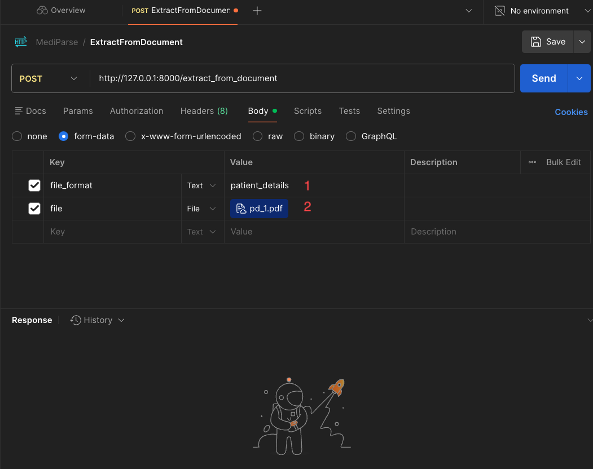
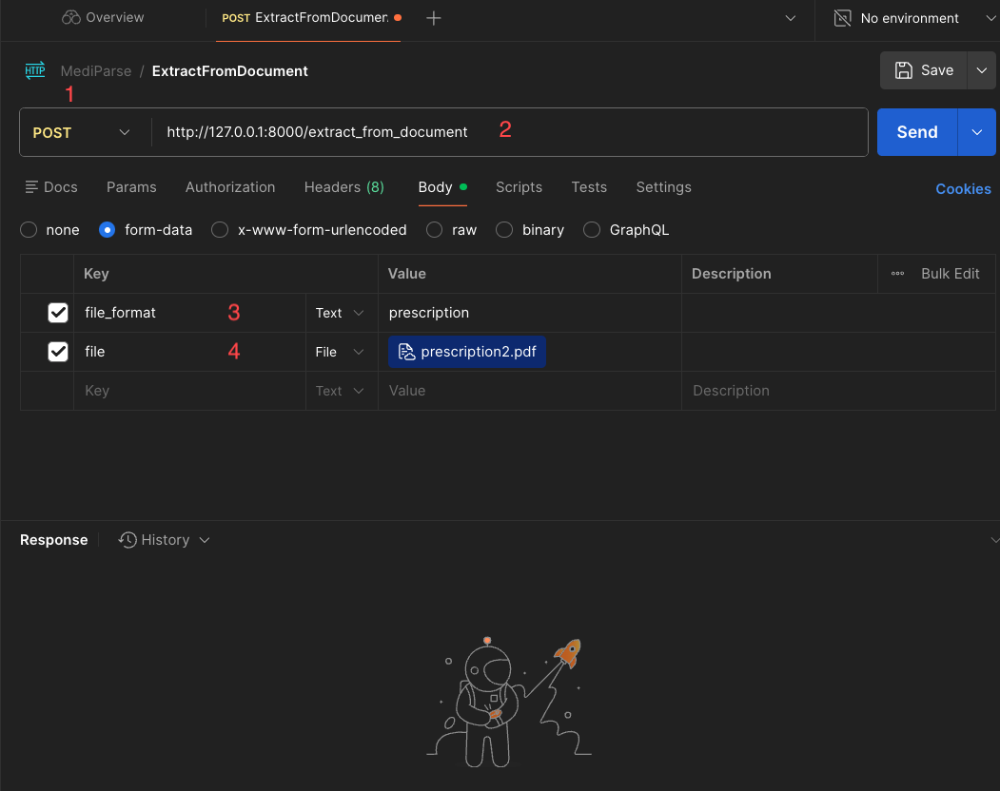
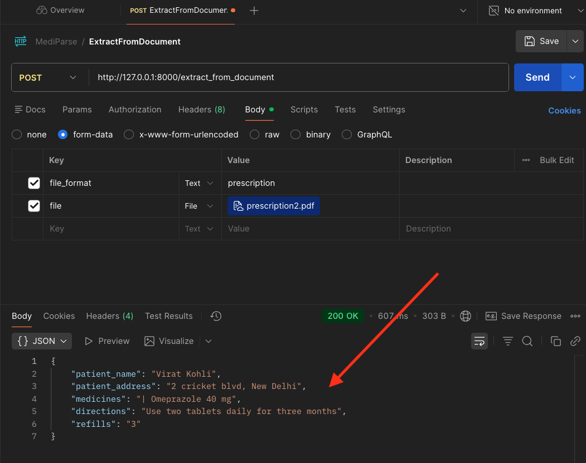

# MediParse: Medical Form Data Extraction

## Project Overview

MediParse is an automated system designed to extract prescription and patient details from medical forms using Computer Vision techniques. The solution combines OCR technology with image preprocessing to ensure high accuracy in data extraction from scanned medical documents.


### Key Features

- ***Automated Data Extraction:*** Processes PDF medical forms without manual intervention

- ***High Accuracy:*** Utilizes OpenCV image preprocessing for improved OCR results

- ***Structured Output:*** Converts unstructured medical forms into formatted, usable data

- ***Scalable Pipeline:*** Handles multiple document formats and layouts


### Technical Architecture


#### Processing Pipeline

The system follows a four-stage pipeline to transform PDF documents into structured data:

***1. PDF to image conversion***
- ***Technology***: `pdf2image`
- ***Purpose***: Converts multi-page PDF documents into a list of high-resolution images
- ***Output***: Individual page images ready for processing

***2. Image Processing***
- ***Technology***: `OpenCV`
- ***Purpose***: Enhances image quality through noise reduction, contrast adjustment, and deskewing
- ***Techniques***:
    - Grayscale conversion
    - Adaptive thresholding
    - Noise removal
- ***Output***: Cleaned, optimized images for OCR

***3. Text Extraction***
- ***Technology***: `pytesseract` (Python wrapper for Tesseract OCR)
- ***Purpose***: Performs Optical Character Recognition to extract raw text from processed images
- ***Output***: Unstructured text blocks containing all document content

***4. Data Parsing & Formatting***

- ***Technology***: `Regular Expressions (Regex)`
- ***Purpose***: Extracts specific medical information (patient details, prescriptions, dosages, etc.)
- ***Output***: Structured, formatted data ready for database storage or further processing


#### Technology Stack

| Component         | Technology     | Purpose                |
| ----------------- | -------------- | -----------------------|
| PDF Processing    | pdf2image      | Document conversion    |
| Image Processing  | OpenCV         | Image enhancement.     |
| OCR Engine        | pytesseract    | Text extraction        |
| Data Parsing      | Regex          | Information extraction |


### Use Cases

- ***Healthcare Providers***: Digitize paper-based prescription records
- ***Medical Records***: Convert legacy documents to digital format


1. `pdf2image` library to convert pdf document to a list of images
2. `OpenCV` for basics image processing to make image more clearer
3. `pytesseract` library to extract text from image
4. `Regular expression` (Regex) to extract useful information from a text block


## Project Structure

```
.
├── backend
│   ├── sample_docs
│   │   ├── patient_details
│   │   │   ├── pd_1.pdf
│   │   │   └── pd_2.pdf
│   │   └── prescription
│   │       ├── prescription1.pdf
│   │       └── prescription2.pdf
│   ├── src
│   │   ├── __init__.py
│   │   ├── data_extractor.py
│   │   ├── main.py
│   │   ├── parser_generic.py
│   │   ├── parser_patient_details.py
│   │   ├── parser_prescription.py
│   │   └── util.py
│   ├── tests
│   │   ├── __init__.py
│   │   ├── test_parser_patient_details.py
│   │   └── test_parser_prescription.py
│   ├── uploads
│   └── __init__.py
├── images
│   └── mediparse_diagram.png
├── pyproject.toml
├── ReadMe.md
└── uv.lock
```


## Installation & Usage Guide

### Prerequisites

Before running the project, you need to install the following system dependencies:


#### System Dependencies

##### Linux (Ubuntu/Debian)
```
sudo apt-get update
sudo apt-get install tesseract-ocr poppler-utils
```

##### MacOS
```
brew install tesseract poppler
```


#### Python Dependencies

Install all Python dependencies from the `pyproject.toml` file.

```
uv sync
```

### Running the Application

Start the Backend Server

From the project root directory, run:

```
uv run python -m backend.src.main
```

The API server will start at `http://127.0.0.1:8000`

### API Testing

You can test the API using any HTTP client like Postman, Insomnia, or curl. Below are examples using Postman.

***Endpoint***: Extract Document Data
***URL***: `POST http://127.0.0.1:8000/extract_from_document`
***Method***: `POST`
***Content-Type***: `multipart/form-data`


##### Example 1: Extract Patient Details

***Request Parameters***:

- `file_format`: `patient_details` (text)
- `file`: `pd_1.pdf` (file upload)




***Response (200 OK)***:

```json
{
  "patient_name": "Kathy Crawford",
  "patient_phone_number": "(737) 988-0851",
  "hepatitis_b_vaccination": "No",
  "medical_problems": "Migraine\n\nC\nat"
}
```


#### Example 2: Extract Prescription Details

***Request Parameters***:

- `file_format`: `prescription` (text)
- `file`: `prescription2.pdf` (file upload)




***Response (200 OK)***:

```json
{
  "patient_name": "Virat Kohli",
  "patient_address": "2 cricket blvd, New Delhi",
  "medicines": "| Omeprazole 40 mg",
  "directions": "Use two tablets daily for three months",
  "refills": "3"
}
```




### Testing

Run the test suite using `pytest`:

```
uv run pytest backend/tests
```


## Future Enhancements

- Integration with deep learning models for better accuracy
- Support for handwritten prescriptions
- Real-time processing capabilities
- API endpoints for integration with healthcare systems


## Tech Stack Summary

- ***Backend Framework***: `FastAPI`
- ***Image Processing***: `OpenCV`, `pdf2image`
- ***OCR Engine***: `Tesseract` (pytesseract wrapper)
- ***Data Extraction***: `Regular Expressions (Regex)`
- ***Package Management***: `uv`
- ***Testing***: `pytest`